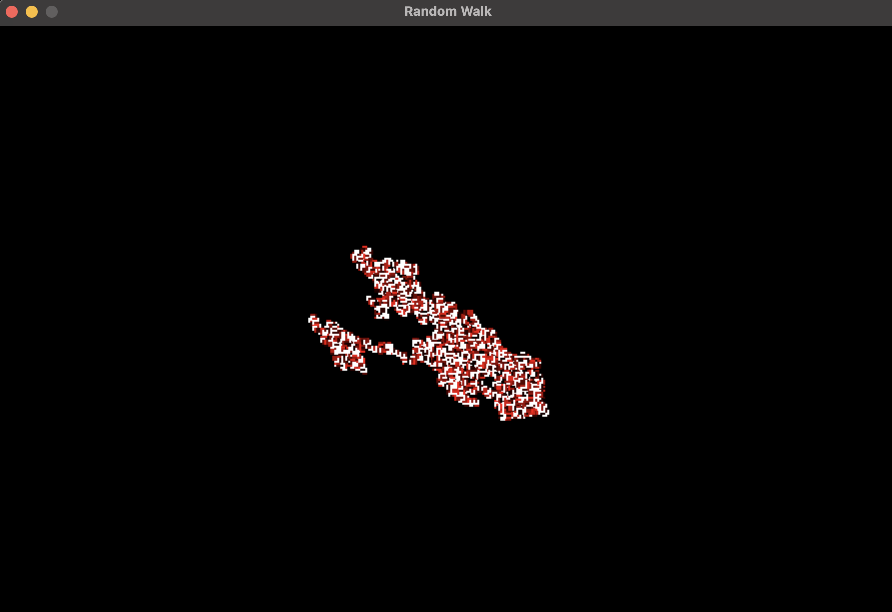

## Overview
- SDL2 random walk implementation, without SDL_CreateRender because I didnt know this function exist, so I 
found a walk around with GetWindowSurface
### Run
```
brew install sdl2
```
```
git clone https://github.com/fivawyr/tiny_randomwalk.git
cd # where ever you clone this repo
clang++ -std=c++17 -Wall -Wextra -o walk code.cpp $(sdl2-config --cflags --libs)    
./walk
```

> Screenshot from the simulation  
### Ressources
- CodeSope [Youtube Video](https://www.youtube.com/watch?v=_PM4Tk3ZUts)
