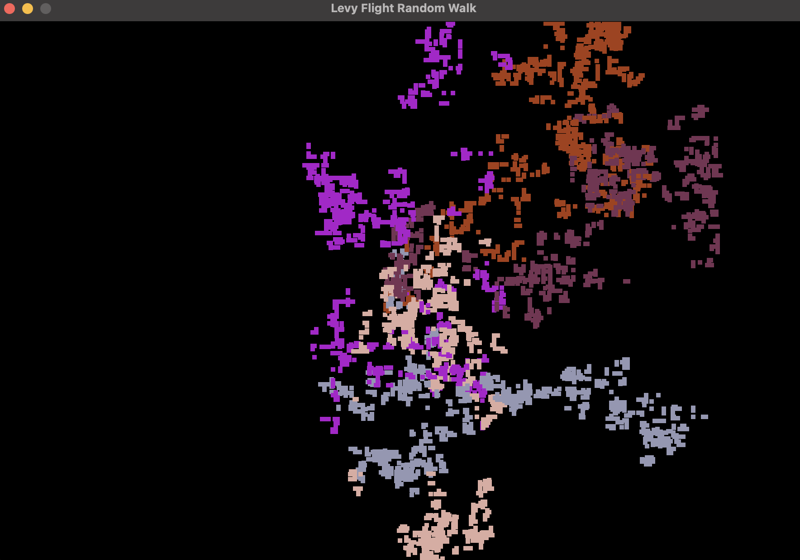

## Overview
- reworked the SDL implementation and used a raylib one with lévy:
&rarr; lévy flight is a mathematic pattern that imitates the hunting route from predators. Its using the power law distribution for getting the random jump $S$
    
$$
S = U-\frac{1}{\gamma}
$$

### Run
```
brew install raylib
```
```
git clone https://github.com/fivawyr/tiny_randomwalk.git
cd # where ever you clone this repo
╰─ g++ code.cpp -o randomwalk \
    -std=c++17 \
    -I/opt/homebrew/include \
    -L/opt/homebrew/lib \
    -lraylib
./walk
```


> Screenshot from the raylig **with** lévy implementation


> Old SDL random walk implementation **without** lévy walk
### Ressources
- CodeSope [Youtube Video](https://www.youtube.com/watch?v=_PM4Tk3ZUts)
